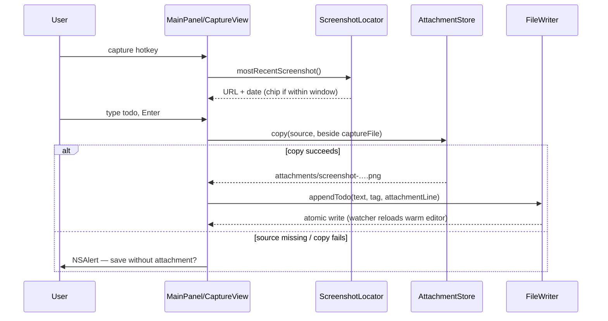
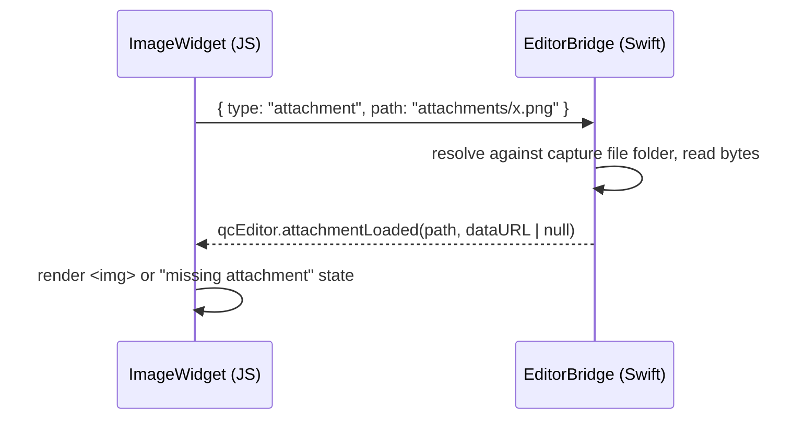

# feat: Attach recent screenshots to quick captures

## Summary

Add screenshot attachment to the capture flow: a screenshot taken within a configurable window pre-attaches as a thumbnail chip when the panel is summoned, a keystroke pulls in older ones, and saving copies the image to an `attachments/` folder beside the capture file with a relative link on an indented child line. Teach `FileWriter` to treat todo + child line as a unit through insertion and archive, and teach the editor to render the link as a folded placeholder expandable to an inline preview.

---

## Problem Frame

Screenshots land on the Desktop disconnected from the note that explains them; relocating one later (e.g. to drag into Claude) means hunting by timestamp. The origin brainstorm (see `docs/brainstorms/2026-06-07-screenshot-attach-requirements.md`) scopes the fix: the capture entry becomes the index that keeps note and image together. Product decisions (copy-not-move, passive detection, auto-attach window + manual fallback, most-recent-only, child-line markdown, screenshots-only v1) are settled there.

---

## Requirements

Origin requirements R1–R15 carry forward unchanged (detection and attach R1–R6, file handling and markdown R7–R10, integrity R11–R13, editor R14–R15). Planning added these, continuing the numbering:

**Save-time failure contract**

- R16. The image is copied before the markdown is written; if the copy fails or the source file is gone at save time, the user is offered (via `NSAlert`) to save the todo without the attachment — never a silent drop, never a dangling link.
- R17. A copy never overwrites an existing file in `attachments/`; name collisions get a numeric suffix.
- R18. The `attachments/` folder and relative link are resolved against the capture file path at save time, not cached at attach time (the path can change in Settings mid-session).

**Chip lifecycle**

- R19. The chip follows the existing text-preservation rule: it survives the ⌘F editor round-trip and is cleared on full dismiss.
- R20. Detection runs only on a fresh summon, not on the ⌘F return; a detached chip stays detached for the rest of that capture session.
- R21. When the tag field routes to `#cal`, the chip is visibly disabled with a short hint — a calendar capture never writes markdown, so the attachment is not kept.

**Editor degradation**

- R22. Expanding a placeholder whose image file is missing shows a "missing attachment" state instead of hanging or showing a broken-image glyph.

---

## Key Technical Decisions

- **Detection: one-shot Spotlight query, folder scan as fallback.** `NSMetadataQuery` for `kMDItemIsScreenCapture == 1` sorted by creation date, run only on summon / pull-in (R6). Verified on this machine (40 screenshots tagged; `mdfind` returns them). Fallback when Spotlight returns nothing: scan the configured screenshot folder (`com.apple.screencapture` `location`, defaulting to `~/Desktop`) for recent screenshot files and take the newest of both results — this also covers Spotlight indexing lag.
- **Detection lives in a standalone helper, not `MainPanel`.** ADR-0001 flags `MainPanel` as the highest-risk file and names helpers as the natural seam. New `ScreenshotLocator` type; `MainPanel`/`CaptureView` only consume its result.
- **Attachment filename: normalized, sortable, space-free.** Copy as `screenshot-YYYY-MM-DD-HHMMSS.png` derived from the source file's creation date; on collision append `-2`, `-3`, … (R17). Space-free relative paths keep the markdown link regex and bridge URL handling simple.
- **`FileWriter` gains an optional attachment line threaded through `appendTodo` → `appendUnderHeading` → `insert`.** The two lines insert as one block at the computed index. `insert` already skips indented children when walking (`^\s+\S`), so existing-pair integrity falls out; only the insertion itself changes. Keep `todoLine`/`sectionName` as the single source of line formats.
- **Archive carries indented children of a checked task.** `extractCompletedItems` consumes the trailing indented lines of an extracted `[x]` line and moves them with it. The parent keeps its existing flatten behavior; the child keeps a 2-space indent under the flattened parent.
- **Editor preview gets image bytes over the JS↔Swift bridge, not widened file access.** The WKWebView loads from the bundle with read access scoped to `dist/`, so a relative `` can't resolve. The image widget requests the attachment by relative path; Swift resolves it against the capture file's folder and returns a base64 data URL (or null → R22 missing state). Avoids loosening WebKit file access and survives capture-file path changes.
- **Fold state is view-local and resets to folded on reload.** Capture-mode appends reload the warm editor from disk; persisting expansion across that is fragile (position-keyed state) for marginal value. v1 accepts the reset.
- **Auto-attach window: 120 s default, UserDefaults-backed `AppState` setting with a row in the Settings Advanced card.** Follows the existing `@Published` + `didSet` + `Keys` pattern.
- **Keystrokes: ⌘⇧S pulls in the most recent screenshot; detach via the chip's × button or ⌫ when the text field is empty.** ⌘⇧S registers in `MainPanel.performKeyEquivalent` (the ⌘F precedent) so it works regardless of focus; ⌫-when-empty lives in `TodoTextEditor.Coordinator.doCommandBy` like the existing Tab/Return mappings.

---

## High-Level Technical Design

Capture-with-attachment save path (failure contract R16 inline):

Editor inline preview over the existing `editorBridge`:

---

## Implementation Units

### U1. Screenshot discovery and attachment store helpers

- **Goal:** `ScreenshotLocator` (most recent screenshot via Spotlight + folder fallback) and `AttachmentStore` (collision-safe copy into `attachments/` beside a given file).
- **Requirements:** R1, R2, R4–R6, R7, R17, R18.
- **Dependencies:** none.
- **Files:** `Sources/QuickCapture/ScreenshotLocator.swift`, `Sources/QuickCapture/AttachmentStore.swift` (new — run `xcodegen generate`), `Tests/QuickCaptureTests/AttachmentStoreTests.swift`.
- **Approach:** `ScreenshotLocator.mostRecent()` returns `(url, createdAt)?`; one-shot `NSMetadataQuery` (or `mdfind`-equivalent metadata API) merged with a scan of the configured screenshot folder, newest wins. `AttachmentStore.copy(source:besideFile:)` creates `attachments/` with intermediate directories, names per the KTD scheme, suffixes on collision, returns the relative link path. Atomic-style failure: throw on any error, mirroring the `NSLog`/throw conventions.
- **Patterns to follow:** `FileWriter.appendUnderHeading` for directory creation + error style; `FileWriterTests.makeTempFile()` for test fixtures.
- **Test scenarios:** (AttachmentStore, temp dirs) copy creates `attachments/` and returns `attachments/screenshot-….png`; name derives from source creation date; second copy of same-named source gets `-2` suffix and overwrites nothing; missing source throws. (ScreenshotLocator) folder-fallback scan picks the newest matching file in a temp dir; returns nil for an empty dir. Spotlight path: `Test expectation: none — requires live Spotlight index; covered by manual verification.`
- **Verification:** unit tests pass; calling `ScreenshotLocator.mostRecent()` in a scratch harness returns the machine's latest real screenshot.

### U2. FileWriter: insert todo + attachment line as one unit

- **Goal:** `appendTodo` accepts an optional attachment line and lands both lines as one block at the priority-computed index.
- **Requirements:** R8, R10, R11. Covers AE4.
- **Dependencies:** none.
- **Files:** `Sources/QuickCapture/FileWriter.swift`, `Tests/QuickCaptureTests/FileWriterTests.swift`.
- **Approach:** thread `attachmentLink: String?` through `appendTodo` → `appendUnderHeading` → `insert`; build the child line (2-space indent, ``) next to `todoLine` so formats stay funneled through one place; in `insert`, insert the lines array instead of a single string. `priorityBucket` continues to read only the first line.
- **Patterns to follow:** `testInsertPriorityItemSkipsOverIndentedChildren` is the template for pair-integrity tests.
- **Test scenarios:** todo+image pair lands together under the right heading; pair with `!!` lands above plain items and below `!!!` with the image line still directly beneath its parent; a later higher-priority insert does not split an existing pair; timestamp suffix (`➕`) on the parent still classifies correctly with a child present; untagged pair lands under `## Quick capture`.
- **Verification:** all existing FileWriter tests still pass plus the new pair tests.

### U3. FileWriter: archive carries attachment children

- **Goal:** archiving a checked todo moves its trailing indented child lines with it.
- **Requirements:** R13. Covers AE5.
- **Dependencies:** none (lands cleanly before or after U2).
- **Files:** `Sources/QuickCapture/FileWriter.swift`, `Tests/QuickCaptureTests/FileWriterTests.swift`.
- **Approach:** in `extractCompletedItems`, after matching a `[x]` line, consume following lines matching the child rule (`^( {2,}|\t)\S`) into the same `ArchivedItem`; parent flattens as today, children re-indent to 2 spaces under it in the archive output.
- **Test scenarios:** checked parent + image child both leave the source and appear consecutively in the archive under the right section; unchecked parent's child is untouched; parent+child as the last two lines of a section and of the file (no trailing newline) archive cleanly without orphaned blanks or dropped headings; child line never appears in the source after archive (no orphans).
- **Verification:** new archive tests pass; existing archive tests unchanged.

### U4. Capture chip UI and lifecycle

- **Goal:** thumbnail chip in the capture box with auto-attach, detach, pull-in keystroke, and `#cal` disabling.
- **Requirements:** R1–R4, R19–R21. Covers AE1, AE2.
- **Dependencies:** U1.
- **Files:** `Sources/QuickCapture/CaptureView.swift`, `Sources/QuickCapture/MainPanel.swift`.
- **Approach:** chip state (`attachedScreenshot: URL?`, `userDetached: Bool`) lives with `todoText`/`tagText` and follows their rules — cleared in the `.capturePanelDidHide` handler, untouched across ⌘F (R19, R20). `MainPanel.show()` (fresh summon only) asks `ScreenshotLocator` and pre-attaches when `createdAt` is within the window setting. Chip renders in the extras block; thumbnail decodes off the main thread via `CGImageSource` with a max pixel size so summon never janks. ⌘⇧S in `performKeyEquivalent` attaches the most recent regardless of age; ⌫-when-empty detaches via `doCommandBy`. When the tag resolves to `cal`, grey the chip with a one-line hint (R21).
- **Patterns to follow:** shake-on-empty state pattern for chip state; `onContentSizeChange` GeometryReader sizing (keep the chip inside the measured `VStack`); ⌘F handling in `performKeyEquivalent`.
- **Test scenarios:** `Test expectation: none — SwiftUI view state and panel behavior; covered by the manual QA script in U5's verification.`
- **Verification:** manual — summon within window shows chip; detach is sticky across ⌘F round-trip; full dismiss clears chip; `#cal` tag greys it.

### U5. Save-path integration

- **Goal:** wire chip → copy → markdown write with the failure contract, plus the window setting.
- **Requirements:** R7, R16–R18, R9. Covers AE3, F1–F3.
- **Dependencies:** U1, U2, U4.
- **Files:** `Sources/QuickCapture/AppDelegate.swift`, `Sources/QuickCapture/MainPanel.swift`, `Sources/QuickCapture/CaptureView.swift`, `Sources/QuickCapture/AppState.swift`, `Sources/QuickCapture/SettingsView.swift`.
- **Approach:** widen the `onSubmit` closure chain (`CaptureView` → `MainPanel.handleSubmit` → `AppDelegate.handleCapture`) to carry the attachment URL. In `handleCapture`: resolve `attachments/` against the live `captureFileURL` (R18), copy first via `AttachmentStore`, then `FileWriter.appendTodo(text, tag, attachmentLine)`; on copy failure or missing source, `NSAlert` offering save-without-attachment (R16), reusing the existing catch/alert style. `#cal` route ignores the attachment (already disabled in U4). Add `screenshotAttachWindow` to `AppState` (120 s default, `Keys` + `didSet` pattern) and a Stepper/Picker row in the Settings Advanced card.
- **Patterns to follow:** `handleCapture`'s existing error alert; `includeTimestamp` setting plumbing.
- **Test scenarios:** `Test expectation: none for the UI thread — FileWriter/AttachmentStore behavior is covered by U1–U3 unit tests.` Manual QA script: F1 happy path (screenshot → hotkey → save → file in `attachments/`, pair in markdown, editor reloads); F2 late summon via ⌘⇧S; F3 detach; AE3 pull-in with no screenshots on disk is a no-op; copy-failure path (point capture file at a read-only dir) shows the alert and saving without attachment works; changing the capture file path between attach and save writes beside the new path.
- **Verification:** the manual QA script passes end-to-end; warm editor reloads and shows the new pair after a capture-mode save.

### U6. Editor: folded image placeholder with bridge-served preview

- **Goal:** image-link child lines render folded by default and expand to an inline preview.
- **Requirements:** R12 (satisfied by the existing `moveCompletedToBottom` child-grouping — confirm visually in the manual checks below), R14, R15, R22.
- **Dependencies:** U2 (line format), U5 (end-to-end demo); bridge work is parallelizable.
- **Files:** `editor-web/src/editor.ts`, `Sources/QuickCapture/MainPanel.swift` (`EditorBridge`).
- **Approach:** in `buildLivePreview`'s line scan, match indented image-link lines (`^(\s*)!\[.*?\]\((\S+)\)\s*$`) and emit a `Decoration.replace` with an `ImageWidget` (mirror `CheckboxWidget`, including `eq()`), added to the same sorted `ranges` array. Cursor-on-line reveals the raw markdown via the existing `selectionOverlaps` gate. Click toggles expanded state (view-local; resets folded on reload); expansion posts `{type: "attachment", path}` to `editorBridge`; Swift resolves against the capture file folder, replies through a `window.qcEditor.attachmentLoaded(path, dataURL|null)` callback; null renders the missing-attachment state (R22). Cap the data-URL image display width in CSS. Run `npm run build` after editing.
- **Patterns to follow:** `CheckboxWidget` + `posAtDOM` click handling; `sendToSwift` / `EditorBridge.userContentController` message shapes; `pushVimSetting` for the Swift→JS callback direction.
- **Test scenarios:** `Test expectation: none — no JS test harness exists in editor-web; behavior is visual.` Manual: folded placeholder on load; cursor on line shows raw markdown; click expands to the image; expanding a deleted attachment shows the missing state; re-org moves the placeholder line with its parent (existing behavior, confirm visually); item count in the status bar is not inflated by image lines.
- **Verification:** `npm run build` then app build; manual checks above against a capture file containing pairs from U5.

---

## Acceptance Examples

Origin AE1–AE6 remain the acceptance bar (most-recent-only, window boundary, empty-disk no-op, priority preservation, archive travel, clipboard exclusion). Planning adds:

- AE7. **Covers R16.** Given the attached screenshot is deleted before Enter, when the user saves, then an alert offers saving without the attachment, and accepting writes a plain todo.
- AE8. **Covers R19, R20.** Given a chip was detached, when the user ⌘Fs to the editor and back and saves, then no image is attached and no re-detection occurred.
- AE9. **Covers R21.** Given a chip is attached and the tag is `cal`, then the chip renders disabled with a hint and the `.ics` flow proceeds without it.
- AE10. **Covers R17.** Given `attachments/screenshot-2026-06-07-143012.png` exists, when another file would get that name, then it lands as `…-143012-2.png` and the existing file is untouched.
- AE11. **Covers R22.** Given an image line whose file is missing, when the placeholder is expanded, then a missing-attachment state renders.

---

## Scope Boundaries

Carried from origin: video, multiple attachments per entry, clipboard paste-in, proactive screenshot reactions, orphan cleanup — all out of v1.

### Deferred to Follow-Up Work

- Fold/expand persistence across editor reloads (v1 resets to folded by decision).
- Attaching from editor mode (capture mode is the only attach surface in v1).
- A JS test harness for `editor-web` (manual verification is the v1 bar, consistent with the rest of the editor).
- A short `CONTEXT.md` note documenting the new non-task indented child line type once the format ships.

---

## Risks

- **Spotlight indexing lag** could miss a seconds-old screenshot at summon. Mitigated: the folder-scan fallback runs in the same lookup and the newest result wins. Residual risk is low and self-corrects via ⌘⇧S.
- **`MainPanel` concentration** (ADR-0001): U4/U5 add panel responsibility. Mitigated by keeping detection and copying in standalone helpers; the panel only orchestrates.
- **FLIP re-org animation keys lines by text content** — two identical image child lines may mis-animate during re-org. Content correctness is unaffected (whole-doc replace); accepted as cosmetic.
- **`⌘⇧S` conflicts**: WebKit/system shortcuts could contest it. If it misbehaves, any unclaimed equivalent works — the keystroke is a one-line change in `performKeyEquivalent`.

---

## Sources & Research

- Origin: `docs/brainstorms/2026-06-07-screenshot-attach-requirements.md`.
- Verified on this machine: `mdfind 'kMDItemIsScreenCapture == 1'` returns 40 screenshots; `com.apple.screencapture location` unset (Desktop default applies).
- Load-bearing code: `Sources/QuickCapture/FileWriter.swift` (`insert` child-skip walk, `extractCompletedItems` non-child-aware extract, `archiveURL` sibling), `Sources/QuickCapture/MainPanel.swift` (`loadEditor` read-access scope, `performKeyEquivalent`, `EditorBridge`, `lastSyncedContent` watcher guard), `Sources/QuickCapture/CaptureView.swift` (`.capturePanelDidHide` clearing, `TodoTextEditor.Coordinator`), `editor-web/src/editor.ts` (`buildLivePreview`, `CheckboxWidget`, `moveCompletedToBottom` child grouping).
- ADRs: 0001 (MainPanel risk, helper seams), 0002 (priority grammar), 0004 (disk-canonical, mutually-exclusive modes).
- Build invariants: `xcodegen generate` after new Swift files; `npm run build` in `editor-web/` after editing `editor.ts`.
