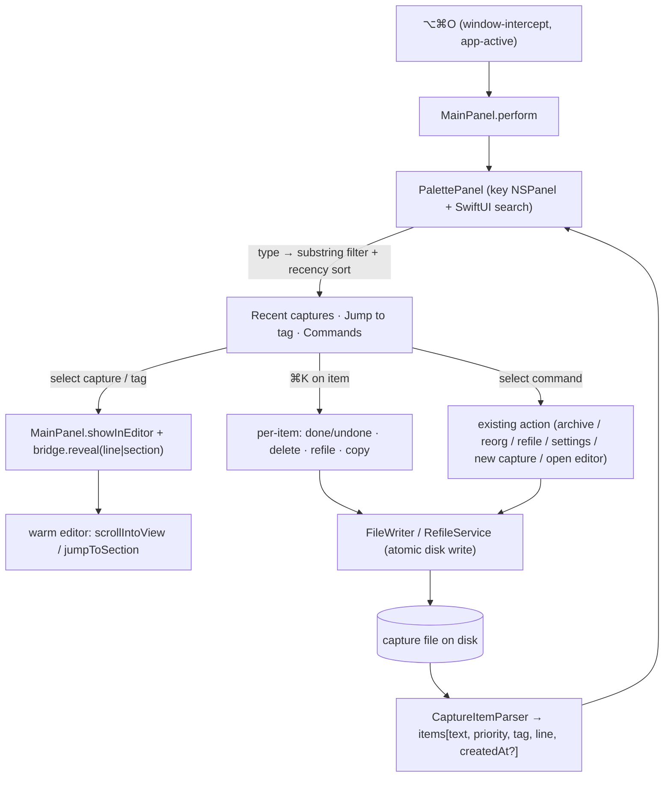
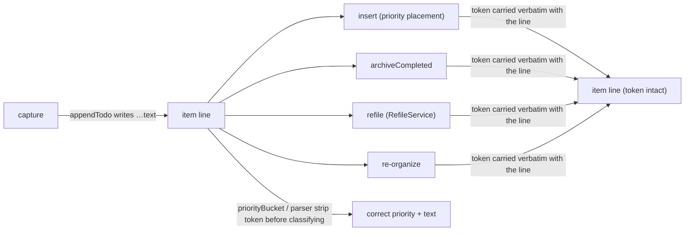

# feat: capture command palette

## Summary

A transient, app-active **command palette** for Quick Capture: a standalone key-capable
floating panel with one search field over **captures and commands**. Live-filter capture
items and press Enter (or click) to jump to that item in the editor; plus jump-to-tag,
new-capture, six global commands, and a per-item actions menu (`⌘K`). Recency comes from a
never-displayed creation-time token written on each capture. `⌥⌘P` and the capture box are
untouched.

Origin: `docs/brainstorms/2026-06-12-capture-command-palette-requirements.md` (issue #82).

---

## Problem Frame

There's no fast path to revisit or act on a past capture — you open the editor and hunt by
scroll or `⌘F` — and no quick launcher for the app's actions. The palette collapses "find an
item or run a command" into one keystroke and one field. Sole user is the app's owner; the
value is their speed over a growing capture file.

---

## Requirements (from origin)

- **R1** transient overlay, not a mode (ADR-0004 preserved) · **R2** dedicated `⌥⌘` chord,
  app-active summon · **R3** `⌥⌘P`/capture box unchanged.
- **R4** one field over captures + commands, sectioned results (Recent captures / Jump to tag
  / Commands) · **R5** substring, case-insensitive · **R6** row = priority dot + text + tag ·
  **R7** empty state shows recent + tags + commands.
- **R8** select capture → editor reveals its line with cursor; select tag → its `## section`.
- **R9** never-displayed creation time as inline hidden token; markdown stays canonical
  (no sidecar) · **R10** Recent sorts by token newest-first, tokenless items fall back to file
  order; token survives append/insert/archive/refile/re-organize and doesn't break priority
  classification.
- **R11** global commands: Open Editor, Archive completed, Re-organize, Refile, Settings,
  New capture · **R12** per-item actions (`⌘K`): mark done/undone, delete, refile, copy text.

Decided this session: **app-active summon** (window-intercept, no second global hotkey);
**palette is its own key-capable panel** (not a non-key child like `TagDropdownWindow`).

---

## Key Technical Decisions

- **Palette is a standalone key `NSPanel`, not a child window.** `TagDropdownWindow`
  (`Sources/QuickCapture/TagDropdownPanel.swift`) is `canBecomeKey: false` — keyboard stays
  in its parent. The palette owns a focused search field, so it must become key. It mirrors
  `TagDropdownPanel`'s *child-window mechanics* (borderless `.nonactivatingPanel`, opaque
  surface, SwiftUI hosting) but is key-capable and centered on screen like editor mode, so it
  floats over whatever's showing and types into its own field.
- **App-active summon via the registry, not a Carbon hotkey.** `⌥⌘O` is a window-intercepted
  `ShortcutRegistry` action (anyMode), handled in `MainPanel.perform(shortcut:)`. No change to
  the `HotKeyConfig`/`AppDelegate` global-hotkey path. Consequence: the palette only opens
  while a Quick Capture window (capture box or editor) is key.
- **Capture-file is parsed Swift-side.** The palette can't reuse the editor's in-browser
  parsing (separate surface, and the editor may be cold). A small parser reads the file into
  items; priority reuses `FileWriter.priorityBucket`, tags are the `## section` H2 the item
  sits under.
- **Hidden token = trailing HTML comment.** `<!--qc:<ISO8601>-->` appended after the item
  text. Invisible in the editor (live-preview hides it) and in Obsidian reading view (HTML
  comments don't render). It lives in the line, so disk stays the single source of truth
  (R9); the parser/`priorityBucket` tolerate it exactly as they already tolerate the `➕`
  marker.
- **Navigation reuses editor primitives.** Reveal-by-line and reveal-section reuse
  `EditorView.scrollIntoView` and `jumpToSection` in `editor-web/src/editor.ts`, driven over
  the existing `editorBridge`. The palette opens editor mode (`showInEditor`) then reveals.

---

## High-Level Technical Design

Data + control flow (palette is its own key panel; navigation/actions route through MainPanel
to disk and the warm editor):

Recency token lifecycle (must survive every line-moving path):

---

## Implementation Units

Grouped into three phases: **A — data substrate**, **B — surface, summon, search, nav**,
**C — commands & actions**.

### U1. Hidden creation-time token

- **Goal:** Every new capture records a never-displayed creation time inline; it survives all
  line-moving operations and is hidden in the editor (R9, R10).
- **Requirements:** R9, R10.
- **Dependencies:** none.
- **Files:**
  - `Sources/QuickCapture/FileWriter.swift` (write token in `appendTodo`; tolerate it in
    `priorityBucket` and any text-extraction helper; preserve across `insert`,
    `archiveCompleted`, refile core)
  - `Sources/QuickCapture/RefileService.swift` (verify/rewrite must carry the token)
  - `editor-web/src/editor.ts` (`buildLivePreview` hides the token span)
  - `Tests/QuickCaptureTests/FileWriterTests.swift`, `FileWriterRefileTests.swift`,
    `RefileServiceTests.swift` (extend)
- **Approach:** Define the token as a trailing `<!--qc:<ISO8601>-->` after the item text
  (after any `➕` marker). `appendTodo` appends it when writing a new item. Every place that
  reads the "text" of a line or classifies priority must strip the token first — same
  tolerance pattern already applied to the `➕ DATE TIME` suffix. Move/copy operations
  (`insert`, `archiveCompleted`, refile, re-organize) operate on whole lines, so the token
  rides along; the work is proving that and fixing any helper that rebuilds a line from parsed
  parts and would drop it.
- **Execution note:** Characterization-first — add tests asserting the token survives each
  mutation before changing those paths.
- **Patterns to follow:** the existing `➕` createdMarker tolerance in `FileWriter.priorityBucket`
  (`FileWriter.swift` ~line 210); atomic-write convention.
- **Test scenarios:**
  - `appendTodo` with timestamping on writes a line ending in `<!--qc:…-->`; the marker is
    well-formed ISO8601.
  - `priorityBucket` returns the same bucket for a line with vs. without the token (incl.
    combined with `➕` and trailing `!`/`!!`/`!!!`).
  - Item text extracted for display excludes the token (and the `➕` suffix).
  - Covers R10. `insert` placing a new item preserves the token on the moved line and on
    neighbors.
  - Covers R10. `archiveCompleted` moves a checked item to the archive file with its token
    intact (and indented→flattened items keep it).
  - Covers R10. Refile core (`FileWriterRefileTests` / `RefileServiceTests`) moves a subtree
    to the target inbox with the token preserved on each line.
  - A line authored by hand without a token classifies and renders normally (no crash, treated
    as tokenless).
- **Verification:** A captured item shows no timestamp in the editor or Obsidian reading view,
  but the raw line carries `<!--qc:…-->`, and that token is still present after archive, refile,
  insert, and re-organize.

### U2. Capture-file item parser

- **Goal:** Parse the capture file into structured items the palette can search and rank
  (R4–R7, R10).
- **Requirements:** R4, R6, R7, R10.
- **Dependencies:** U1 (token format).
- **Files:**
  - `Sources/QuickCapture/CaptureItemParser.swift` (new)
  - `Tests/QuickCaptureTests/CaptureItemParserTests.swift` (new)
- **Approach:** A pure parser: input = file text, output = `[CaptureItem]` where each item
  carries display text (token + `➕` stripped, priority markers stripped for display), priority
  bucket (via `FileWriter.priorityBucket`), tag (the enclosing `## section` name; `Quick
  capture` for the catch-all), 0-based line number, and an optional `createdAt` parsed from the
  token. Also expose the tag list with per-tag counts (for Jump-to-tag, R7). Sort helper:
  recent = `createdAt` desc, tokenless last in file order.
- **Patterns to follow:** `FileWriter` section/priority parsing; `FileWriterTests` style.
- **Test scenarios:**
  - A file with two `## section`s yields items tagged by their section; catch-all items tag as
    `Quick capture`.
  - Priority dot/bucket per item matches `FileWriter.priorityBucket` (incl. `[x]` checked = done
    bucket).
  - Covers R6. Display text strips the hidden token, the `➕` suffix, and trailing priority
    markers.
  - Covers R10. Items sort newest-first by `createdAt`; tokenless items sort after timestamped
    ones, in file order.
  - Covers R7. Tag list reports correct per-tag counts.
  - Line numbers point at the item's line (used later for reveal); nested child lines are not
    surfaced as separate items.
  - Empty file / first-line `# Inbox` only → no items, no crash.
- **Verification:** Given a real capture file, the parser returns items with correct text,
  priority, tag, line, and recency order; tag counts match the sections.

### U3. Palette panel shell (surface)

- **Goal:** A standalone key-capable floating panel hosting a SwiftUI search field + sectioned
  results list; opens, focuses the field, dismisses on Esc (R1, R2 surface half).
- **Requirements:** R1.
- **Dependencies:** none (can build with stub data before U2 wiring).
- **Files:**
  - `Sources/QuickCapture/PalettePanel.swift` (new — the `NSPanel` + lifecycle)
  - `Sources/QuickCapture/PaletteView.swift` (new — SwiftUI search UI)
  - (after adding files) `xcodegen generate`
- **Approach:** An `NSPanel` subclass that **can** become key (`canBecomeKey = true`),
  borderless `.nonactivatingPanel`, opaque surface + shadow, centered on the active screen.
  Hosts `PaletteView` (search `TextField` auto-focused, results `List`/`ScrollView` with
  section headers). Mirror `TagDropdownPanel`/`CaptureView` theming (`Theme`, `Metrics`,
  `TypeScale`, opaque surface per 56b274f). Arrow keys move highlight; Esc closes; Return
  activates the highlighted row. No data logic yet — render injected view-model rows.
- **Patterns to follow:** `TagDropdownPanel.swift` (child-window mechanics, opaque card),
  `CaptureView.swift` (SwiftUI-in-panel, key handling via `.onKeyPress`), `MainPanel` key-panel
  setup (`canBecomeKey`).
- **Test scenarios:** `Test expectation: none for the panel/SwiftUI shell — AppKit window +
  SwiftUI layout, covered by manual QA.` Any extracted highlight-movement/section-grouping
  helper gets a unit test under `Tests/QuickCaptureTests/`.
- **Verification:** A dev hook opens the panel over the capture box; it takes key, the search
  field is focused, arrow keys move the highlight, Esc closes and returns key to the prior
  window.

### U4. Summon wiring (app-active)

- **Goal:** `⌥⌘O` opens the palette while a Quick Capture window is showing; opening it doesn't
  trip capture-mode click-away dismiss (R2).
- **Requirements:** R2, R3.
- **Dependencies:** U3.
- **Files:**
  - `Sources/QuickCapture/ShortcutRegistry.swift` (new `openPalette` action — `⌥⌘O`, anyMode,
    window-intercepted, no editor keymap)
  - `Sources/QuickCapture/MainPanel.swift` (`perform(shortcut:)` arm; suppress `resignKey`
    self-dismiss while the palette is key)
  - `Tests/QuickCaptureTests/ShortcutRegistryTests.swift` (extend)
- **Approach:** Add the registry case (anyMode, `isWindowIntercepted = true`, `menuTitle`
  "Search…" so it appears in the editor menu). `MainPanel.perform` opens the `PalettePanel`.
  While the palette is key, set the existing `canDismissOnBlur = false` guard (the same one
  used during the picker/editor transitions) so MainPanel doesn't self-dismiss on losing key;
  restore on palette close, returning key to MainPanel.
- **Patterns to follow:** existing `ShortcutRegistry` cases + `MainPanel.perform` arms; the
  `canDismissOnBlur` guard around `enterPickerSurface`/`closePickerSurface`.
- **Test scenarios:**
  - `interceptedAction(key:"o", modifiers:[.command,.option], editorOpen:false)` → `openPalette`;
    same in `editorOpen:true` (anyMode).
  - The new chord doesn't collide with any existing active-mode chord
    (`testNoDuplicateChordsWithinAnyActiveMode` still passes).
  - `Test expectation: none` for the dismiss-suppression timing — manual QA (open palette from
    capture box; capture box must not vanish).
- **Verification:** From the capture box and from the editor, `⌥⌘O` opens the palette; closing
  it returns to the prior surface unchanged; the capture box never self-dismisses underneath it.

### U5. Search + results (captures + jump-to-tag)

- **Goal:** Wire the parser into the palette: live substring filter, Recent-captures section
  (recency-sorted, dot+text+tag rows), Jump-to-tag section (R4–R7).
- **Requirements:** R4, R5, R6, R7.
- **Dependencies:** U2, U3.
- **Files:**
  - `Sources/QuickCapture/PaletteView.swift`, `Sources/QuickCapture/PalettePanel.swift`
    (consume parser output; build a view-model)
  - `Sources/QuickCapture/PaletteViewModel.swift` (new — filter/sort/section logic, pure &
    testable)
  - `Tests/QuickCaptureTests/PaletteViewModelTests.swift` (new)
- **Approach:** On open, read the capture file → `CaptureItemParser` → items + tag counts. The
  view-model produces sections: empty query → Recent captures (recency order, capped to a
  sensible N), Jump to tag, Commands (U7); non-empty query → substring-filter (case-insensitive)
  captures, tags, and command names, each in its section, hiding empties. Rows render the
  priority dot (matching the editor's priority hues), display text, and tag.
- **Patterns to follow:** `CaptureView` row rendering; `TagDropdownContent` dot/row styling;
  priority hue source used by the editor.
- **Test scenarios:**
  - Covers R5. Query "buy" matches items containing "buy" case-insensitively; non-matches
    excluded.
  - Covers R7. Empty query shows Recent captures in recency order plus the tag list.
  - Covers R6. Each capture row exposes the right priority bucket + tag.
  - A query matching nothing yields empty sections (no crash, a quiet empty state).
  - Tag rows show correct counts; selecting filters vs. navigating are distinct (tag row =
    navigate, not filter).
- **Verification:** Typing live-filters the list; clearing the query restores the recent +
  tags view; rows show dot + text + tag.

### U6. Navigation bridge (jump to item / section)

- **Goal:** Selecting a capture opens the editor on that item's line with the cursor; selecting
  a tag opens it on that `## section` (R8).
- **Requirements:** R8.
- **Dependencies:** U2, U5; relies on U3/U4 to dismiss the palette on activate.
- **Files:**
  - `editor-web/src/editor.ts` (new bridge-invokable `revealLine(line)` and reuse
    `jumpToSection`/section-reveal; both reuse `EditorView.scrollIntoView`)
  - `Sources/QuickCapture/MainPanel.swift` (a `reveal(line:)` / `reveal(section:)` that
    `showInEditor` then posts over `editorBridge`)
  - (rebuild editor bundle: `npm run build` in `editor-web/`)
- **Approach:** Palette activate → dismiss palette → `MainPanel.showInEditor` (enter editor
  mode, warm web view) → post a reveal message over the bridge with the target line (for an
  item) or section name/index (for a tag). The editor maps line→position and
  `scrollIntoView(pos, {y:"start"})`, placing the cursor on the line. Tag reveal reuses the
  existing `jumpToSection` path. Guard the line lookup against a file that changed between parse
  and reveal (clamp / nearest).
- **Patterns to follow:** existing `editorBridge` message handlers + `qcEditor.invoke`;
  `jumpToSection`/`scrollIntoView` (`editor.ts` ~line 1221); `showInEditor`.
- **Test scenarios:**
  - `Test expectation: none for the cross-process bridge nav — manual QA.` Manual: pick an item
    deep in the file → editor opens scrolled to it, cursor on its line; pick a tag → editor at
    that `## section`.
  - Any pure helper (line→target resolution, clamp when out of range) gets a unit test.
  - Edge: selecting an item whose line no longer exists (file shrank) reveals the nearest valid
    position without error.
- **Verification:** From the palette, Enter on a capture brings the editor forward scrolled to
  that exact line; Enter on a tag lands on its section heading.

### U7. Global commands

- **Goal:** Typeable global commands in the Commands section run existing app actions (R11).
- **Requirements:** R11.
- **Dependencies:** U5 (results pipeline), U6 (Open Editor reuses reveal/showInEditor).
- **Files:**
  - `Sources/QuickCapture/PaletteViewModel.swift` (command list + matching)
  - `Sources/QuickCapture/MainPanel.swift` / `AppDelegate.swift` (dispatch to existing actions)
- **Approach:** A static command set — Open Editor, Archive completed, Re-organize, Refile,
  Settings, New capture — each mapped to its existing entry point (`archiveCompleted`,
  re-organize, refile, `SettingsWindowController`, the capture box, `showInEditor`). Commands
  match by substring on their titles and render in the Commands section. Selecting dismisses the
  palette and invokes the action. (Refile/Re-organize are editor-context actions — selecting
  routes through the editor like the menu items do.)
- **Patterns to follow:** `ShortcutRegistry.menuActions` / `MainPanel.perform` dispatch;
  `SettingsWindowController` invocation from the menu bar.
- **Test scenarios:**
  - Covers R11. Query "arch" surfaces "Archive completed"; selecting it triggers the archive
    path.
  - Command titles match case-insensitively; non-matching queries hide the Commands section.
  - `Test expectation: none` for the action side effects beyond what each action's own tests
    already cover — manual QA that each command fires.
- **Verification:** Typing a command name and pressing Enter runs the corresponding action and
  closes the palette.

### U8. Per-item actions (⌘K)

- **Goal:** `⌘K` on a highlighted item opens an actions menu: mark done/undone, delete, refile,
  copy text (R12).
- **Requirements:** R12.
- **Dependencies:** U5 (highlighted item), U2 (item→line mapping).
- **Files:**
  - `Sources/QuickCapture/PaletteView.swift` (the `⌘K` actions affordance)
  - `Sources/QuickCapture/FileWriter.swift` (toggle done/undone and delete a subtree by line —
    new helpers if absent)
  - `Sources/QuickCapture/RefileService.swift` (reused for refile)
  - `Tests/QuickCaptureTests/FileWriterTests.swift` (extend for toggle/delete)
- **Approach:** `⌘K` opens a small actions list scoped to the highlighted item. Mark done/undone
  flips `[ ]`↔`[x]` on the item's line (atomic write, token preserved). Delete removes the
  item's subtree (item + attachments + nested children — reuse the refile subtree-span rule).
  Refile reuses the `RefileService` pipeline (prompt for target as the editor does). Copy puts
  the item's display text on the pasteboard. After a mutating action, the palette refreshes its
  parsed items (file is canonical).
- **Patterns to follow:** `FileWriter` atomic line edits + subtree span (shared with refile);
  `RefileService` pipeline; pasteboard usage.
- **Test scenarios:**
  - Covers R12. Toggle done on a `[ ]` item writes `[x]` on that line, leaving the token and
    other lines untouched; toggling again restores `[ ]`.
  - Covers R12. Delete removes the item and its nested/attachment lines (subtree span) and
    nothing else.
  - Refile from the palette moves the subtree via the existing pipeline (covered by
    `RefileServiceTests`; add a palette-entry smoke case).
  - Copy places the display text (token/markers stripped) on the pasteboard.
  - Edge: action on an item whose line shifted (file changed) operates on the right item or
    no-ops safely (re-resolve by content/line).
- **Verification:** `⌘K` on an item offers the four actions; each takes effect on disk and the
  palette reflects the change.

---

## Scope Boundaries

**In scope:** the data substrate (hidden token + parser), the key-panel surface, app-active
`⌥⌘O` summon, search over captures + commands, jump-to-item/section, the six global commands,
and the five per-item actions.

### Deferred to Follow-Up Work
- Fuzzy / typo-tolerant matching (substring only here).
- Command-prefix syntax (`>`); searching section/tag text as query targets beyond the
  Jump-to-tag section.
- "Recent" reflecting last-*edited* or last-*jumped-to*, not just created.
- **Global (system-wide) summon** — a second Carbon hotkey so the palette opens from any app.
  This plan ships app-active summon; global is a clean follow-up (add a second `HotKey`
  registration alongside the capture hotkey).
- Recency for items captured outside the app / on other devices (tokenless → file order).

---

## System-Wide Impact

- **Capture file format** gains a hidden token on new items. Obsidian reading view and this
  editor hide it; raw source and Obsidian source-mode show it. Existing items stay tokenless and
  sort last in Recent — acceptable per R10.
- **Every file-mutating path** (append/insert/archive/refile/re-organize) must preserve the
  token; U1 covers this with characterization tests. Risk concentrated there.
- **Activation/key handling:** a new key-capable panel coexists with `MainPanel`'s
  click-away-dismiss; U4 guards the transition.

---

## Risks & Mitigations

- **Token dropped by a line-rebuilding helper.** Any code that reconstructs a line from parsed
  parts (rather than moving the whole line) would lose the token. *Mitigation:* U1
  characterization tests across all four mutation paths; prefer whole-line moves.
- **Parse/reveal drift.** The file can change between the palette parsing it and the editor
  revealing a line. *Mitigation:* clamp/nearest on reveal (U6); re-resolve before per-item
  actions (U8).
- **Capture box self-dismiss under the palette.** Losing key could collapse the capture box.
  *Mitigation:* reuse the `canDismissOnBlur` guard (U4).
- **Priority misclassification from the token.** A trailing comment could fool `priorityBucket`.
  *Mitigation:* strip the token before classifying; explicit U1 tests combining token + `➕` +
  `!!!`.

---

## Open Questions (resolve in implementation)

- Exact summon chord — `⌥⌘O` is the candidate; confirm against the `⌥⌘` namespace and macOS
  reserved combos at U4.
- Recent-captures cap (how many in the empty state) and whether tag rows also appear when a
  query is active.
- Command-vs-capture ordering when both match (section order is fixed; within-merge ranking is
  a small U5/U7 detail).
- Whether "New capture" from the editor context returns to the capture box or captures inline.
